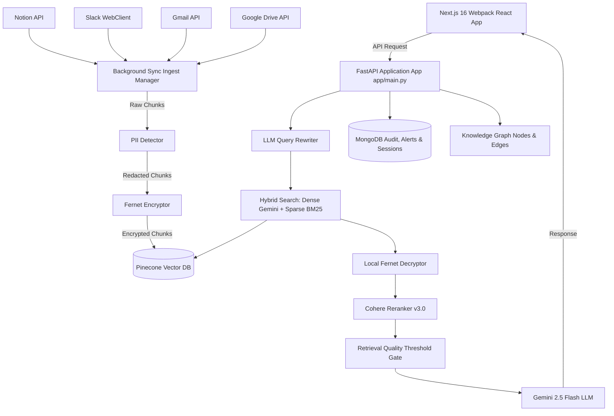

# 🧠 NeuralOS — The Complete Technical Interview Preparation Guide

This comprehensive guide serves as your primary cheat sheet and reference document for your full-stack internship interview. It covers the **business context**, **system architecture**, **database design**, **security protocols**, **frontend components**, and **critical code details** of the NeuralOS codebase.

---

## 🌟 1. Project Overview & Pitch

### What is NeuralOS?
**NeuralOS** is an enterprise-grade **AI Reasoning Core and Knowledge Graph** system designed to search, analyze, and automate actions on fragmented company data from integrations like **Notion, Slack, Google Drive, and Gmail**. 

### The Core Problem Statement
1. **Knowledge Fragmentation**: Company data is scattered across separate silos. Employees spend up to 20% of their time searching for answers, leading to communication gaps.
2. **Operational Vulnerabilities**: Real-time incidents (e.g., server timeouts, SLA breaches, client escalations) go unnoticed because alerts are buried in channels.
3. **Security Risks in AI Ingestion**: Modern LLMs risk exposing Personally Identifiable Information (PII) or leaking intellectual property when indexing unredacted company data.

### NeuralOS Value Proposition (Your Interview Pitch)
* **The "Company Brain"**: A single, unified query layer that retrieves facts, reasons across contexts, and serves clean answers.
* **Secure-by-Design Ingestion**: Statically redacts PII and encrypts database chunks using unique derived keys before any external vector hosting.
* **Proactive Risk Intelligence**: Continuously monitors ingest streams to alert stakeholders about critical client risks, SLA status, and technical issues.
* **Task Actionability**: Allows users to convert findings into real-world tasks (e.g., creating Notion tickets, sending Slack notifications) through verified workflow approvals.

---

## 🏗️ 2. High-Level Architecture

NeuralOS is designed as a secure **FastAPI (Python)** backend coupled with a **Next.js (React)** dashboard.

---

## 🛠️ 3. Technology Stack & Infrastructural Choices

| Component | Technology | Why this was chosen over alternatives? |
| :--- | :--- | :--- |
| **Frontend Framework** | **Next.js 16** (React) | Standard SSR/CSR React ecosystem for fast dashboards; integrates easily with modern UI. |
| **Graph Visualization** | **D3 Force Layout** (`react-force-graph-2d`) | Renders complex node-edge relationships natively on canvas for high performance. |
| **Backend API** | **FastAPI (Python)** | High-performance asynchronous routing, native support for JSON schema validations via Pydantic, and native Python ML/AI ecosystem compatibility. |
| **Database (NoSQL)** | **MongoDB** | Schema-less storage perfect for handling unstructured logs, sync history, sessions, and node properties. |
| **Vector Database** | **Pinecone** | Managed serverless vector index with support for metadata filtering and isolated namespace partitioning per client/company. |
| **Dense Embeddings** | **Gemini** (`gemini-embedding-001`) | High dimension-to-cost efficiency (768 dimensions), robust semantic mapping. |
| **Sparse Search** | **BM25** (`rank_bm25.BM25Okapi`) | Captures exact lexical tokens (serial codes, names, error tags) that semantic models fail to align. |
| **Reranking Engine** | **Cohere Reranker** (`rerank-english-v3.0`) | Cross-encoder matching evaluates query-document relevance far better than cosine similarity. |
| **LLM Engine** | **Gemini 2.5 Flash** | Ultra-fast token speeds, strong streaming support, and massive context length. |

---

## 🔒 4. Key Ingestion & Security Pipelines (Deep Dive)

### 1. PII Redaction ([pii_detector.py](file:///c:/Users/soham%20mane/OneDrive/Desktop/neuralos/backend/app/pii_detector.py))
NeuralOS prevents sensitive details from leaking into Pinecone or third-party APIs. When syncing data, chunks pass through regex patterns to replace PII with `[TYPE REDACTED]` tokens.
* **Standard Patterns Handled**:
  - Email, Phone (Indian/International formats)
  - Aadhaar Cards (`\b\d{4}\s\d{4}\s\d{4}\b`)
  - PAN Card (`\b[A-Z]{5}[0-9]{4}[A-Z]{1}\b`)
  - Credit Cards, SSN

### 2. PBKDF2 Multi-Tenant Encryption ([encryption.py](file:///c:/Users/soham%20mane/OneDrive/Desktop/neuralos/backend/app/encryption.py))
To prevent cross-tenant data leaks and secure vector storage:
* **Key Derivation Function (KDF)**: Derives a unique base64 symmetric key for each company using `PBKDF2HMAC` with `SHA256` hashing and `100,000` iterations.
* **Fernet Symmetric Encryption**: Every text chunk is encrypted using the derived key before being stored in Pinecone. The vector embeddings themselves are generated on the unencrypted, safe text but the stored payload is fully encrypted.
* **On-the-fly Decryption**: Matching search chunks are decrypted in-memory on the backend *only after* they are retrieved.

---

## 🔍 5. Retrieval & RAG Pipeline Flow

When a user chats with NeuralOS:

1. **Query Rewriting ([rag.py](file:///c:/Users/soham%20mane/OneDrive/Desktop/neuralos/backend/app/rag.py))**:
   Converts conversational history + the new user question into optimized search keywords using `gemini-2.5-flash` to improve vector lookup accuracy.
2. **Parallel Hybrid Search ([hybrid_search.py](file:///c:/Users/soham%20mane/OneDrive/Desktop/neuralos/backend/app/hybrid_search.py))**:
   - **Dense Search**: Queries Pinecone index using Gemini embeddings to find semantic matches.
   - **Sparse Search**: Tokenizes all documents and uses **BM25 Okapi** keyword matching.
3. **Reciprocal Rank Fusion (RRF)**:
   Fuses dense and sparse search rankings using a weighted reciprocal rank calculation:
   $$RRF\_Score = w_{dense} \cdot \frac{1}{rank_{dense} + 60} + w_{sparse} \cdot \frac{1}{rank_{sparse} + 60}$$
   *(We use $w_{dense} = 0.7$ and $w_{sparse} = 0.3$)*
4. **Cohere Reranking**:
   Pulls the top candidates and reranks them using `rerank-english-v3.0` to narrow down to the most relevant 4 chunks.
5. **Quality Gate ([rag.py](file:///c:/Users/soham%20mane/OneDrive/Desktop/neuralos/backend/app/rag.py) - `check_retrieval_quality`)**:
   If the maximum cosine similarity score falls below `0.55`, NeuralOS warns the user that the source matches are weak to prevent hallucinations.
6. **Streaming LLM Response**:
   The context is formatted with sources and streamed back to the Next.js frontend using Server-Sent Events (SSE).

---

## 🤖 6. Workflows & Proactive Agents

### Intent Detection & Action Workflows ([workflows.py](file:///c:/Users/soham%20mane/OneDrive/Desktop/neuralos/backend/app/workflows.py))
NeuralOS doesn't just read information; it acts on it. It detects active intents from user chats:
* **Task Intent (`CREATE_TASK`)**: "Remind Priya to fix the API by tomorrow." -> Extracts title, assignee, and generates a Notion page.
* **Slack Intent (`SEND_SLACK`)**: "Notify operations team that Flipkart is failing." -> Extracts channel name, target recipient, formats message, and queues a Slack API post.
* **Human-in-the-Loop Gateway**: Actions are not executed directly. They are logged as `pending` inside MongoDB. The user must review and click "Approve" on the frontend Workflows panel before the FastAPI scheduler fires the Slack/Notion API call.

### Anomaly & Risk Alerts ([anomaly.py](file:///c:/Users/soham%20mane/OneDrive/Desktop/neuralos/backend/app/anomaly.py))
A background cron job runs periodic semantic checks on indexed chunks to detect hidden business risks:
* **Client Risk Check**: Embeds risk phrases ("SLA breach", "complaint", "angry client") and searches Pinecone. Finding low scores triggers critical alerts.
* **System Failures**: Searches for "bug", "crash", "timeout" to surface engineering anomalies.

---

## 🧠 7. Relationship Knowledge Graph

### Graph Structure ([graph.py](file:///c:/Users/soham%20mane/OneDrive/Desktop/neuralos/backend/app/graph.py))
NeuralOS manages a simulated schema mapping relationships between key entities:
* **Nodes**: Person, Client, Incident, Project.
* **Edges / Relationships**: 
  - `OWNS_ACCOUNT` (e.g., Ananya Iyer owns Flipkart)
  - `FIXED` (e.g., Dev Mehta fixed Flipkart Zone 3 Incident)
  - `MANAGED` (e.g., Priya Nair managed Incident)

### D3 Force Layout ([KnowledgeGraph.jsx](file:///c:/Users/soham%20mane/OneDrive/Desktop/neuralos/frontend/app/components/KnowledgeGraph.jsx))
* Built using `react-force-graph-2d` loaded dynamically via Next.js client-side imports.
* Uses canvas context to render animated particles traveling along edges representing active communication streams.
* Dynamically color-codes nodes based on attributes (e.g., Client nodes turn red if they are "at_risk").

---

