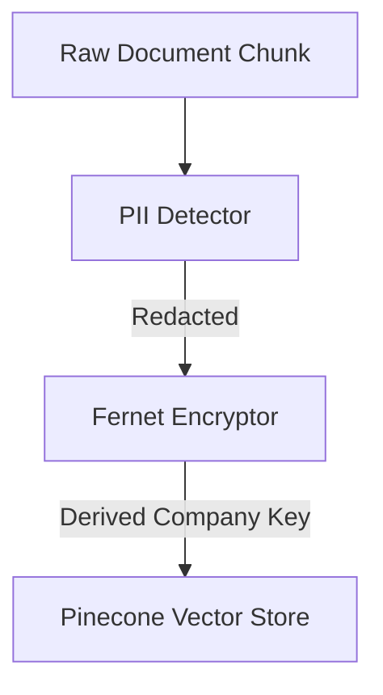

# NeuralOS — Company Brain 🧠

NeuralOS is an enterprise-grade AI Reasoning Core and Knowledge Graph system designed to search, analyze, and action company data from Notion, Slack, Google Drive, and Gmail. It combines state-of-the-art Hybrid RAG search pipelines, secure data handling, and automated workflows into a unified, privacy-first interface.

---

## 🌟 Key Features

### 1. **Hybrid RAG & Fusion Pipeline**
- **Semantic Dense Search**: Indexing and retrieval using Gemini embeddings.
- **Lexical Sparse Search**: Integrated **BM25** text-matching algorithm to capture precise keyword hits.
- **Reciprocal Rank Fusion (RRF)**: Merges dense and sparse search scores with weighted ranking parameters.
- **Cohere Reranker**: Rerank top results via `rerank-english-v3.0` for maximum prompt relevance.
- **Query Rewriter**: Translates conversational questions into multi-term optimized queries.

### 2. **Enterprise Security & Privacy**
- **PII Detection & Redaction**: Automatically scans and strips sensitive data (Emails, Phones, Aadhaar, PAN, SSNs, Credit Cards) before vector index storage.
- **Encryption at Rest**: Custom Fernet-based symmetric encryption keys derived per company using PBKDF2 with SHA256 hashing.
- **Approval Gateways**: Auto-generated tasks and Slack alerts require human-in-the-loop validation in the Workflows Dashboard before execution.

### 3. **Auto-Sync Scheduler**
- Built-in background sync manager triggers hourly refreshes for all connected integrations.
- Dynamic dashboard card reporting next execution time, scheduler health, and manual override sync prompts.

### 4. **Dynamic Knowledge Graph**
- Automated entity extraction (People, Clients, Incidents, Projects) maps relationships using graph databases.
- Custom interactive Force Graph view in the frontend showing node attributes and health metrics.

---

## 🛠️ Architecture & Setup

### Repository Structure
```text
├── .vscode/               # Workspace configuration
├── backend/               # FastAPI Python application
│   ├── app/
│   │   ├── main.py        # API endpoints
│   │   ├── rag.py         # RAG pipeline logic
│   │   ├── hybrid_search.py # RRF and BM25 search
│   │   ├── encryption.py  # PBKDF2 encryption derivation
│   │   ├── pii_detector.py # PII regex patterns and scanner
│   │   └── scheduler.py   # Hourly cron manager
│   └── .env.example       # Backend environmental properties
└── frontend/              # Next.js 16 Webpack React UI
    ├── app/
    │   ├── page.js        # Main Dashboard
    │   └── onboarding/    # Setup flow
    └── package.json
```

### Installation

#### 1. Backend Setup
1. Navigate to the backend directory:
   ```bash
   cd backend
   ```
2. Install dependencies:
   ```bash
   pip install -r requirements.txt
   ```
3. Set up environment variables in a `.env` file:
   ```env
   GEMINI_API_KEY=your_gemini_key
   GEMINI_API_KEY_BACKUP=your_backup_gemini_key
   PINECONE_API_KEY=your_pinecone_key
   PINECONE_INDEX_NAME=your_pinecone_index
   MONGODB_URI=your_mongodb_uri
   COHERE_API_KEY=your_cohere_key
   ENCRYPTION_SECRET=your_secret_encryption_salt
   ```
4. Run the development server:
   ```bash
   python -m uvicorn app.main:app --reload
   ```

#### 2. Frontend Setup
1. Navigate to the frontend directory:
   ```bash
   cd frontend
   ```
2. Install Node packages:
   ```bash
   npm install
   ```
3. Run the Next.js Webpack development server:
   ```bash
   npm run dev
   ```
   Open `http://localhost:3000` to start onboarding.

---

## 🔒 Security Guardrails

All chunks undergo the following processing before storage:

During retrieval, matching vectors are pulled, verified against the quality threshold, decrypted locally using the company's private key, and reranked before serving context to the LLM.
